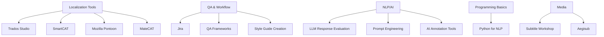

# 
Duygu TAŞ (杜依依)

🌍 Localization & AI Language Expert • Certified Translator • QA Specialist  
🎯 Open to Relocation • 📧 duygutasw@hotmail.com • 📱 +90 542 374 7442  

---

## ✨ About Me

Hello! I'm Duygu — a tech-savvy, multilingual localization specialist with over **6 years** of experience bridging languages and systems across legal, technical, multimedia, and AI-driven projects.

From **translating World Bank contracts** to evaluating **LLM outputs** for Turkish NLP models, I’ve worked at the intersection of **language, technology, and quality assurance**. I love building smart, scalable localization solutions that not only translate words, but *translate meaning across cultures.*

Currently:
- 🌐 Deepening my skills in **AI/NLP workflows** (LLM evaluation, prompt testing, data annotation)
- 🚀 Transitioning toward **localization program/project management**
- 📚 Learning full-scope **project delivery skills** via **Google Project Management Certificate**

---

## 🧩 Language & Localization Matrix

| Language Pair     | Specializations                                                                 | Tools Used                            |
|------------------|----------------------------------------------------------------------------------|----------------------------------------|
| **English ↔ Turkish** | Financial/legal content, AI training data, corporate & legal documents           | Trados, SmartCAT, Jira, Pontoon        |
| **Chinese → English/Turkish** | Marketing copy, technical docs, educational material                        | Subtitle Workshop, SmartCAT, Aegisub   |

---

## 🛠 Technical Proficiencies

---

## 📚 Education & Certifications

- 🎓 **Chinese Language** – Fudan University, Shanghai (2024–2025)
- 🎓 **BA English Linguistics** – Hacettepe University, Ankara (Honors)
- 🏅 **Google Project Management** – Open University (2025)
- 🧠 **Freelance AI Linguist Certificate** – micro1
- 🌐 **Website Localization for Translators** – Udemy (Dorota Pawlak)
- 🐍 **Intro to Python** – Global AI Hub
- 📜 **Certified Translation e-Certificate** – Anadolu University (CEVFOR)
- 🧑‍🏫 **TESOL 120h** – World TESOL Academy
- 🇹🇷 **Teaching Turkish as a Foreign Language** – Yildiz Technical University

---

## 🌟 Portfolio Highlights

### 🏦 [Financial Localization Case Study](projects/finance)
**Client:** Izmir Municipality (World Bank, EBRD)  
**Highlights:**
- Translated high-value contracts with zero critical errors
- Built multilingual termbase of 500+ terms
- Reduced QA revision rate by 40%

### 🤖 [AI Linguistic Evaluation Project](projects/ai)
**Role:** Freelance AI Linguist for Turkish NLP  
**Impact:**
- LLM response evaluation (5,000+ entries)
- Created rubric for Turkish-specific QA
- Improved model fluency by 22% within 3 months

### 📚 [Literary & Media Translation Samples](projects/literary)
**Focus:** Fiction, Humor, Idioms, Emotion  
**Notes:**
- Refined MT for publication
- Adapted narrative voice and tone
- Subtitle QA: 2,000+ mins translated + reviewed

---

## 🌐 Community & Volunteering

- 🌍 **Translators without Borders** – Volunteer Linguist (2019–present)
- 🎷 **Ankara Jazz Festival** – Interpreter/Host
- 🧑‍🎓 **Hacettepe Linguistics Community** – Media Lead & Exec Board
- 🇪🇺 **EU Comenius Project** – Youth Delegate

---

## 📬 Contact & Links

- 📧 Email: [duygutasw@hotmail.com](mailto:duygutasw@hotmail.com)
- 🔗 [LinkedIn](https://linkedin.com/in/duygu-ta%C5%9F-%E6%9D%9C%E4%BE%9D%E4%BE%9D-1622b585)
- 🧾 [Resume (PDF)](assets/Duygu-Taş-Resume-2025.pdf)
- 🗂 [Certificates](certificates)
- 🧪 [AI/NLP Projects](projects/ai)
- 🌐 [GitHub Pages Portfolio](https://duygutas.github.io/)

  
  
  

